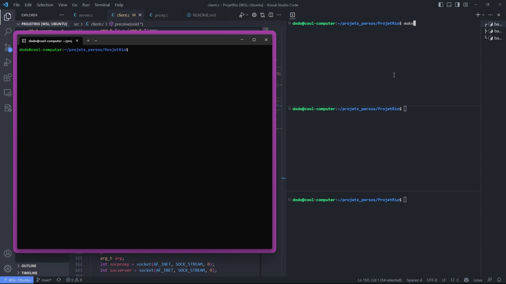

# ProjetRio
## Description
Implementation du modele serveur proxy client

## Installation
Clonez le projet puis

```bash
cd ProjetRio
make
```

## Utilisation
### Serveur
```bash
bin/server <ip_server> <port_server> 
```
### Proxy
```bash
bin/proxy <ip_proxy> <port_proxy> <ip_server> <port_server>
```
### Client
```bash
bin/client <ip_proxy> <port_proxy>
```

### Exemple


